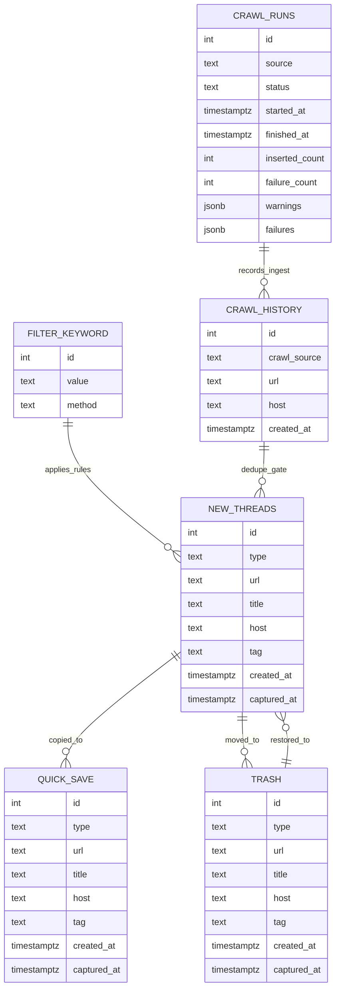

# Applemint v3

개인용 트렌드 링크 수집/정리 프로젝트입니다.
여러 커뮤니티 소스를 크롤링해 `new-threads`에 적재하고, 웹 UI에서 빠르게 확인/분류(`Quick Save`, `Trash`)할 수 있도록 구성되어 있습니다.

> 이 문서는 개인 프로젝트 운영 관점에 맞춰 작성되었으며, 설치/배포 가이드는 의도적으로 제외했습니다.

## 주요 기술 스택

### Frontend
- `Next.js 16` (App Router)
- `React 19` + `TypeScript (strict)`
- `@tanstack/react-query` (목록/무한 스크롤/캐시 무효화)
- `Tailwind CSS` + `shadcn/ui`(Radix 기반 컴포넌트)
- `lucide-react`, `sonner`, `vaul`, `next-themes`

### Backend / Data
- `Supabase Auth` + `@supabase/ssr` (쿠키 기반 SSR 인증)
- `Supabase Postgres` (`new-threads`, `quick-save`, `trash`, `crawl-history`, `filter-keyword`)
- `Supabase Edge Functions` (`supabase/functions/crawl-source`)
- `SQL migration` 기반 성능 튜닝 및 원자적 RPC (`move_thread`, `ingest_crawl_items`)

### Crawling / Parsing
- 표준 `fetch`와 요청별 timeout
- `cheerio` HTML 파싱
- `linkifyjs` URL 추출
- 소스별 크롤러 모듈 분리 (`arcalive`, `battlepage`, `insagirl`)

### 품질 / 보안 유지보수
- `Biome 2.4.7` 포맷·린트·정적 검사
- GitHub PR CI (`Vitest`, `pgTAP`, `Deno`, `TypeScript`, production build, Playwright E2E)
- GitHub `CodeQL` 워크플로우
- `Dependabot` 주간 보안 업데이트
- 커스텀 보안 스크립트 (`scripts/security/*`)

## 핵심 기능

- 인증 사용자만 `/main` 접근 가능 (서버 레이아웃 + 미들웨어 세션 갱신)
- 소스별 크롤링 결과 수집 후 중복 제거 및 키워드 기반 타입 분류
- `new-threads` 무한 스크롤 목록 + 타입별 통계/필터
- `Quick Save` 이동, `Trash` 이동/복원 워크플로우
- 설정 페이지에서 수동 크롤링, 최근 90일 실행 이력·파서 추세 확인 및 신규 스레드 일괄 정리

## 아키텍처 개요

1. UI(`/main/setting`)에서 수동 크롤링 호출
2. `POST /api/crawl/manual`이 DB의 단일 소유자 권한을 확인한 뒤 Supabase Edge Function(`crawl-source`) 호출
3. Edge Function이 `begin_crawl_run`으로 global DB lock과 실행 이력을 원자적으로 생성하고 `POST /api/crawl` 내부 API 호출
4. 크롤링 결과를 `filter-keyword` 기준으로 필터링/타입 분류
5. `ingest_crawl_items` RPC가 `crawl-history` claim과 `new-threads` 적재를 하나의 트랜잭션으로 확정
6. `finish_crawl_run`이 결과 저장과 lock 해제를 원자적으로 완료
7. UI는 스레드 API와 `GET /api/crawl/runs`로 목록·운영 이력을 조회

## 프로젝트 구조

```text
app/
  api/
    crawl/                 # 소스별 크롤러 + 통합 크롤링 엔드포인트
    new-threads/           # 신규 스레드 목록/통계 API
  auth/, login/, signout/  # 인증 흐름
  main/                    # 메인, 퀵세이브, 휴지통, 설정 화면

components/
  ui/                      # shadcn/ui 기반 공통 컴포넌트

utils/
  supabase/                # browser/server/middleware 클라이언트 팩토리

supabase/
  functions/crawl-source/  # 크롤링 적재 파이프라인 Edge Function
  migrations/              # 인덱스/RPC 등 DB 변경 이력

scripts/security/          # GitHub 보안 알림 수집/게이트 스크립트
reports/security/          # 보안 점검 결과 산출물
lib/                       # 공통 타입/유틸
```

## 데이터 테이블 관계도



- 현재 스키마는 명시적 FK 제약보다 PostgreSQL RPC(`move_thread`, `bulk_move_new_threads_to_trash`)로 이동 원자성을 유지합니다.
- `new-threads.tag`는 배열 성격의 태그 데이터를 저장합니다.
- `crawl-history`는 `(crawl_source, url)` 유니크 인덱스로 중복 유입을 방지합니다.
- `crawl_runs`는 재시도를 포함한 한 번의 실행을 한 행으로 보존하며 90일이 지난 이력은 매일 03:15 KST에 정리합니다.
- `crawl_alert_incidents`와 `crawl_alert_notifications`는 소스 장애 상태와 GitHub Issue 전달 outbox를 보존합니다.
- 장애 감지 기준과 운영 절차는 [`docs/CRAWLER_ALERT_OPERATIONS.md`](docs/CRAWLER_ALERT_OPERATIONS.md)를 참고합니다.
- 통계 API는 `new-threads` 기반 RPC(`get_new_threads_stats`)를 사용합니다.

## 유지보수 가이드

### 1) 크롤러 소스 추가/변경
- `app/api/crawl/<source>-parser.ts`에 네트워크와 분리된 순수 파서 구현
- `app/api/crawl/<source>.ts`에서 요청 결과를 공통 파서 계약에 연결
- `app/api/crawl/route.ts` 스위치에 타겟 등록
- 반환 타입은 `{items, attempted, succeeded, failures, warnings, parserObservations}` 구조를 유지
- 정상 빈 목록·일부 제외는 `info`, 최소 추출 건수 미달·높은 제외율은 `warning`으로 기록하며 구조 변경은 parser failure로 구분
- `partial`은 actionable warning 또는 부분 failure가 있을 때만 사용하고 정보성 진단만 있으면 `succeeded`로 기록
- 파서 변경 시 `app/api/crawl/fixtures`의 정제 fixture와 source별 parser 테스트를 함께 갱신
- 파서 최소 건수 변경 시 observation과 설정 화면의 추세 기준도 함께 검증
- 소스 장애 대비 재시도/로그 전략 유지 (`retryOperation`, `logger.ts`)

### 2) 데이터 분류/필터 정책 관리
- 타입 분류 기준은 `supabase/functions/crawl-source/index.ts`의 `defineType`에서 처리
- 무시 키워드/분류 키워드는 DB `filter-keyword` 테이블에서 제어

### 3) 조회 성능 및 통계 로직
- `new-threads`, `quick-save`, `trash` 목록 API는 `(created_at, id)` 복합 커서 기반 무한 스크롤 사용
- 통계는 Postgres RPC `get_new_threads_stats`를 통해 집계
- 쿼리 변경 시 API(`app/api/new-threads/*`)와 SQL 함수를 함께 수정

### 4) 보안 운영
- 기준 문서: `SECURITY.md`
- 로컬 보안 점검:
  - `pnpm security:collect-alerts`
  - `pnpm security:baseline`
  - `pnpm security:gate`
  - `pnpm security:overrides`
- CI에서는 CodeQL + Dependabot 흐름으로 지속 점검

### 5) 코드 컨벤션
- TS strict + 경로 별칭 `@/*`
- 포맷/린트 규칙은 `biome.json` 기준
- `pnpm deadcode`로 미사용 파일·의존성·export를 검사
- Vitest 커버리지는 CI에서 statements/lines 50%, branches/functions 44% 이상을 유지
- 운영·배포 기준 브랜치는 `master`, 통합 개발 브랜치는 `develop`
- 로컬 전체 검증은 `supabase db start` 후 `pnpm run ci`
- 브라우저 E2E는 Docker가 실행 중인 상태에서 `pnpm test:e2e`로 수행하며 로컬 DB를 초기화함
- 최초 실행 전 `pnpm exec playwright install chromium`으로 테스트 브라우저를 설치
- E2E 준비 과정은 `--local`과 loopback 주소를 검증하므로 원격 DB를 사용하지 않음
- `pnpm ci`는 pnpm의 clean-install 명령이므로 프로젝트 검증에는 사용하지 않음
- 신규 데이터 모델 필드 추가 시:
  - `lib/type-defs.ts`
  - Supabase 관련 쿼리 코드
  - 통계/필터 API 및 UI 표시부
  를 함께 동기화

## 유지보수용 주요 환경 변수

- `NEXT_PUBLIC_SUPABASE_URL`
- `NEXT_PUBLIC_SUPABASE_ANON_KEY`
- `SUPABASE_SERVICE_ROLE_KEY` (서버 전용)
- `SUPABASE_URL` (manual crawl fallback)
- `CRAWL_INTERNAL_SECRET` (Next/Edge에 동일하게 설정하는 32바이트 이상 내부 secret)
- `CRAWL_API_BASE_URL` (Edge Function -> 내부 크롤링 API 주소)
- `DEBUG_CRAWL`, `LOG_LEVEL`
- `GITHUB_TOKEN` 또는 `GH_TOKEN` (보안 스크립트 실행 시)
- GitHub Actions variable `SUPABASE_URL`, secret `SUPABASE_SERVICE_ROLE_KEY` (Crawler Health workflow)

Applemint는 migration에 고정한 단일 Supabase Auth 계정만 사용할 수 있습니다. 신규 가입은 비활성화하며 목록 조회는 소유자에게만 허용되고, 스레드 변경은 소유자 확인이 포함된 RPC를 통해서만 수행합니다.

## 검증 명령

- `pnpm test`: Next API, 인증, UI loading, optimistic cache 단위 테스트
- `pnpm test:coverage`: 단위 테스트와 V8 커버리지 하한선 검사
- `pnpm test:db`: 이동·적재 rollback, 권한, lock pgTAP 테스트
- `pnpm typecheck`: TypeScript strict 검사
- `pnpm check:edge`: 고정된 `deno.lock`으로 Edge Function 타입 검사
- `pnpm test:edge`: Edge helper Deno 단위 테스트
- `pnpm build`: Next.js 프로덕션 빌드
- `pnpm test:e2e`: 로컬 Supabase 초기화 후 Chromium 브라우저 흐름 검증
- `pnpm test:e2e:ui`: 로컬 Supabase 초기화 후 Playwright UI 모드 실행

원격 migration history 정렬과 배포 순서는 [`docs/P0_DEPLOYMENT.md`](docs/P0_DEPLOYMENT.md)를 따릅니다.
