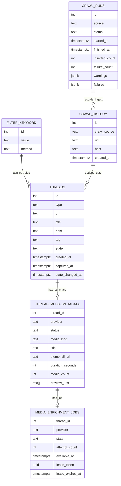

# Applemint v3

개인용 트렌드 링크 수집/정리 프로젝트입니다.
여러 커뮤니티 소스를 크롤링해 `threads(state='inbox')`에 적재하고, 웹 UI에서 빠르게 확인/분류(`Quick Save`, `Trash`)할 수 있도록 구성되어 있습니다.

> 이 문서는 개인 프로젝트 운영 관점에 맞춰 작성되었으며, 설치/배포 가이드는 의도적으로 제외했습니다.

## 주요 기술 스택

### Frontend
- `Next.js 16` (App Router)
- `React 19` + `TypeScript (strict)`
- `@tanstack/react-query 5.101.4` (목록/무한 스크롤/낙관적 상태 이동)
- `Tailwind CSS` + `shadcn/ui`(Radix 기반 컴포넌트)
- `lucide-react`, `sonner`, `vaul`, `next-themes`

### Backend / Data
- `Supabase Auth` + `@supabase/ssr` (쿠키 기반 SSR 인증)
- `Supabase Postgres` (`threads`, `crawl-history`, `filter-keyword`, media metadata·durable queue)
- `Supabase Cron` + `pg_net` 기반 예약 실행
- `SQL migration` 기반 성능 튜닝 및 원자적 RPC (`transition_thread_state`, `ingest_crawl_items`)

### Crawling / Parsing
- 표준 `fetch`와 요청별 timeout
- `cheerio` HTML 파싱
- `linkifyjs` URL 추출
- 소스별 크롤러 모듈 분리 (`arcalive`, `battlepage`, `insagirl`)

### 품질 / 보안 유지보수
- `Biome 2.5.5` 포맷·린트·정적 검사
- GitHub PR 필수 검증 (`verify`: Biome, Knip, Vitest, pgTAP, production build)
- 주간 GitHub `CodeQL`과 일간 `Security Gate` 워크플로우
- `Dependabot` 주간 보안 업데이트
- 커스텀 보안 스크립트 (`scripts/security/*`)

## 핵심 기능

- 인증 사용자만 `/main` 접근 가능 (서버 레이아웃 + 미들웨어 세션 갱신)
- 소스별 크롤링 결과 수집 후 중복 제거 및 키워드 기반 타입 분류
- `threads` inbox 무한 스크롤 목록 + 타입별 통계/필터
- YouTube·Imgur 정확 URL 분류, 비동기 메타데이터 수집과 공급자 전용 카드
- `Quick Save` 이동, `Trash` 이동/복원 워크플로우
- 설정의 기능별 화면에서 소스별 예약 주기·수동 수집, 최근 90일 실행 이력, 신규 글 일괄 정리

## 아키텍처 개요

1. UI(`/main/setting/crawling`)에서 정책을 수정하거나 수동 크롤링 호출
2. Supabase Cron이 5분마다 cooldown과 가용 동시성을 확인해 Next 예약 API를 비동기로 호출
3. DB가 소스별 cooldown, source lock, 최대 2개 동시 실행을 원자적으로 판정
4. 크롤링 결과를 `filter-keyword` 기준으로 필터링/타입 분류
5. `ingest_crawl_items` RPC가 `crawl-history`, `threads`, YouTube와 cutover 이후 신규 Imgur의 media metadata·queue 생성을 하나의 트랜잭션으로 확정
6. 별도 Supabase Cron이 durable queue가 있는 provider의 내부 media worker를 `pg_net`으로 호출
7. YouTube·Imgur worker가 lease 안에서 정규화된 요약만 저장하고 retry·dead 상태를 보존
8. `finish_crawl_run`이 크롤링 결과 저장과 lock 해제를 원자적으로 완료
9. UI는 tRPC `thread.*`, `crawl.runs`, `crawlPolicy.*`로 목록·운영 이력을 조회

수동 크롤링은 cooldown을 우회하지만 동일 소스 중복과 최대 동시성 제한은 지킵니다. 예약 실행,
heartbeat, 비정상 종료 복구, 비활성 media scheduler의 승인·smoke·롤백 절차는
`docs/CRAWL_SCHEDULING.md`를 참고합니다.
브라우저 tRPC, 내부 REST, Supabase RPC와 Zod 계약의 목표 경계 및 전환 원칙은
[`docs/COMMUNICATION_ARCHITECTURE.md`](docs/COMMUNICATION_ARCHITECTURE.md)를 참고합니다.

## 프로젝트 구조

```text
app/
  api/
    crawl/                 # 소스별 크롤러 + 수동/예약 실행 엔드포인트
    media/                 # YouTube·Imgur adapter + lease worker + 내부 엔드포인트
    trpc/                  # 브라우저 일반 조회·변경의 단일 tRPC 진입점
  auth/, login/, signout/  # 인증 흐름
  main/                    # 메인, 퀵세이브, 휴지통, 설정 화면

components/
  ui/                      # shadcn/ui 기반 공통 컴포넌트

contracts/                 # tRPC·REST·Supabase raw response의 Zod 계약
server/
  repositories/            # Supabase RPC와 raw response 검증
  services/                # transport 독립 application service
  trpc/                    # context, procedure, router와 오류 변환
trpc/                      # 브라우저 tRPC·TanStack Query provider
utils/
  supabase/                # browser/server/middleware 클라이언트 팩토리

supabase/
  migrations/              # 인덱스/RPC 등 DB 변경 이력

scripts/security/          # GitHub 보안 알림 수집/게이트 스크립트
reports/security/          # 보안 점검 결과 산출물
lib/                       # 공통 타입/유틸
```

## 데이터 테이블 관계도



- `threads.state`는 `inbox | saved | trash`이며 `transition_thread_state`가 동일 ID의 행을 단일 `UPDATE`로 이동합니다.
- `created_at`과 `captured_at`은 이동 시 불변이고 `state_changed_at`만 상태 변경 시 갱신됩니다.
- `threads.tag`는 배열 성격의 태그 데이터를 저장합니다.
- `crawl-history`는 `(crawl_source, url)` 유니크 인덱스로 중복 유입을 영구적으로 방지합니다. 사용자 목록에서 삭제된 URL도 재수집하지 않으며, 기간 만료 삭제·아카이브·월별 파티셔닝을 적용하지 않습니다.
- `crawl_runs`는 재시도를 포함한 한 번의 실행을 한 행으로 보존하며 90일이 지난 이력은 매일 03:15 KST에 정리합니다.
- `crawl_alert_incidents`는 소스 장애의 발생·복구 상태를 보존하고 설정 화면에 표시합니다.
- `thread_media_metadata`는 외부 원시 응답 없이 YouTube·Imgur 표시용 요약만 저장합니다.
- `media_enrichment_jobs`는 provider별 lease·retry·dead 상태를 보존하며 사용자 클라이언트에 직접 노출하지 않습니다.
- media worker Cron은 기존 crawl scheduler와 별도이며 migration 적용 직후에는 비활성입니다.
- `crawl-history` 용량 측정, 백업·복구, 성능 검증 절차는 [`docs/CRAWL_HISTORY_RETENTION.md`](docs/CRAWL_HISTORY_RETENTION.md)를 참고합니다.
- media queue 조회, 승인 후 수동 smoke·활성화와 롤백 절차는 [`docs/CRAWL_SCHEDULING.md`](docs/CRAWL_SCHEDULING.md)를 참고합니다.
- 상태별 목록·통계 API는 `list_threads_page`, `get_thread_stats` RPC를 사용합니다.

## 유지보수 가이드

### 1) 크롤러 소스 추가/변경
- `app/api/crawl/<source>-parser.ts`에 네트워크와 분리된 순수 파서 구현
- `app/api/crawl/<source>.ts`에서 요청 결과를 공통 파서 계약에 연결
- `app/api/crawl/crawl-runner.ts`의 `CRAWLERS`에 타겟 등록
- 반환 타입은 `{items, attempted, succeeded, failures, warnings, parserObservations}` 구조를 유지
- 정상 빈 목록·일부 제외는 `info`, 최소 추출 건수 미달·높은 제외율은 `warning`으로 기록하며 구조 변경은 parser failure로 구분
- `partial`은 actionable warning 또는 부분 failure가 있을 때만 사용하고 정보성 진단만 있으면 `succeeded`로 기록
- 파서 변경 시 `app/api/crawl/fixtures`의 정제 fixture와 source별 parser 테스트를 함께 갱신
- 파서 최소 건수 변경 시 observation과 설정 화면의 추세 기준도 함께 검증
- 소스 장애 대비 재시도/로그 전략 유지 (`retryOperation`, `logger.ts`)

### 2) 데이터 분류/필터 정책 관리
- 무시·타입 분류 기준은 `app/api/crawl/pipeline-helpers.ts`의 `matchFilteredUrl`에서 처리
- 무시 키워드/분류 키워드는 DB `filter-keyword` 테이블에서 제어

### 3) 조회 성능 및 통계 로직
- 상태별 목록 API는 `(state_changed_at, id)` 복합 커서 기반 무한 스크롤 사용
- 통계는 Postgres RPC `get_thread_stats`를 통해 집계
- TanStack Query 키는 `threads/list/<state>/<filter>`와 `threads/stats/<state>/<filter>` 계약을 유지
- 쿼리 변경 시 tRPC router, application service·repository, query option factory와 SQL RPC 계약을
  함께 수정

### 4) 보안 운영
- 기준 문서: `SECURITY.md`
- 로컬 보안 점검:
  - `pnpm security:collect-alerts`
  - `pnpm security:baseline`
  - `pnpm security:gate`
  - `pnpm security:overrides`
- CodeQL은 주간·수동, Security Gate는 일간·수동으로 실행하며 Dependabot 흐름과 함께 지속 점검

### 5) 코드 컨벤션
- TS strict + 경로 별칭 `@/*`
- 포맷/린트 규칙은 `biome.json` 기준
- `pnpm deadcode`로 미사용 파일·의존성·export를 검사
- Vitest 커버리지는 선택 실행하는 `pnpm test:coverage`에서 statements/lines 50%, branches/functions 44% 이상을 유지
- 운영·배포 기준 브랜치는 `master`, 통합 개발 브랜치는 `develop`
- 빠른 로컬 정적 검증은 `pnpm check`, 병합과 같은 전체 검증은 `supabase db start` 후 `pnpm verify`
- 브라우저 E2E는 자동 CI·smoke에 포함하지 않으며 사용자가 필요할 때 `pnpm test:e2e`로 핵심 흐름 2개를 확인
- E2E는 Docker가 실행 중인 상태에서 로컬 DB를 초기화하므로 테스트 데이터가 필요한 경우에만 실행
- 최초 실행 전 `pnpm exec playwright install chromium`으로 테스트 브라우저를 설치
- E2E 준비 과정은 `--local`과 loopback 주소를 검증하므로 원격 DB를 사용하지 않음
- 신규 데이터 모델 필드 추가 시:
  - `lib/type-defs.ts`
  - Supabase 관련 쿼리 코드
  - 통계/필터 API 및 UI 표시부
  를 함께 동기화

## 유지보수용 주요 환경 변수

- `NEXT_PUBLIC_SUPABASE_URL`
- `NEXT_PUBLIC_SUPABASE_ANON_KEY`
- `SUPABASE_SERVICE_ROLE_KEY` (서버 전용)
- `SUPABASE_URL` (서버 전용, 미설정 시 `NEXT_PUBLIC_SUPABASE_URL` 사용)
- `CRAWL_INTERNAL_SECRET` (Next 예약 API와 Supabase Vault가 공유하는 32바이트 이상 secret)
- `YOUTUBE_API_KEY` (YouTube metadata worker 전용 서버 환경 변수)
- `IMGUR_CLIENT_ID` (Imgur metadata worker 전용 서버 환경 변수)
- `DEBUG_CRAWL`, `LOG_LEVEL`
- `GITHUB_TOKEN` 또는 `GH_TOKEN` (보안 스크립트 실행 시)
- Supabase Vault `crawl_app_base_url`, `crawl_internal_secret` (크롤러와 media worker 정기 예약 호출)

Applemint는 migration에 고정한 단일 Supabase Auth 계정만 사용할 수 있습니다. 신규 가입은 비활성화하며 목록 조회는 소유자에게만 허용되고, 스레드 변경은 소유자 확인이 포함된 RPC를 통해서만 수행합니다.

## 검증 명령

- `pnpm check`: Biome, Knip, TypeScript를 이용한 빠른 로컬 정적 검증
- `pnpm verify`: Biome → Knip → Vitest → pgTAP → production build 순서의 필수 검증
- `pnpm test`: Next API, 인증, UI loading, optimistic cache 단위 테스트
- `pnpm test:coverage`: 선택 실행하는 단위 테스트와 V8 커버리지 하한선 검사
- `pnpm test:db`: 9개 계약 suite로 구성된 이동·적재 rollback, 권한, lock·queue·scheduler pgTAP 테스트
- `pnpm typecheck`: TypeScript strict 검사
- `pnpm build`: Next.js 프로덕션 빌드
- `pnpm test:e2e`: 사용자 주도로 로컬 Supabase 초기화 후 Chromium 핵심 흐름 2개 검증
- `pnpm test:e2e:ui`: 사용자 주도로 로컬 Supabase 초기화 후 Playwright UI 모드 실행
