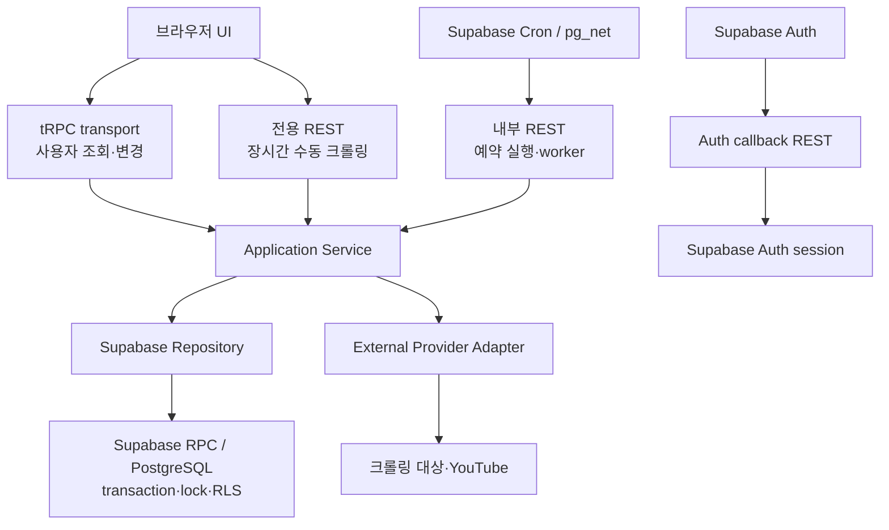

# 통신 계층 아키텍처 및 구현 원칙

> 상태: 구현 완료(2026-07-28), 배포 후 성능·운영 지표 확인 대기
> 적용 범위: Browser, Next.js App Router, Supabase Auth/Postgres/Cron, 외부 크롤링·미디어 API
> 관련 문서: [크롤러 예약 실행·잠금 운영 가이드](CRAWL_SCHEDULING.md),
> [보안 경고 운영 절차](SECURITY_OPERATIONS.md)

## 1. 목적

이 문서는 Applemint의 통신 경계를 호출자와 책임에 따라 고정하고, 신규 기능과 기존 API 전환 시
동일한 기준을 적용하기 위한 기준 문서입니다.

목표는 다음과 같습니다.

- 브라우저와 Next 서버 사이의 계약을 tRPC와 Zod로 타입 안전하게 관리합니다.
- Supabase Cron, Auth callback, 외부 API처럼 TypeScript 타입 공유가 불가능하거나 표준 HTTP가 필요한
  경계는 REST를 유지합니다.
- transaction, lock, optimistic concurrency, durable queue claim과 같은 데이터 무결성은 Supabase
  RPC와 PostgreSQL이 계속 소유합니다.
- transport와 업무 로직을 분리해 tRPC와 REST가 같은 기능을 중복 구현하지 않게 합니다.
- 입력, 출력, 오류, 인증, 관측성, 테스트와 롤백 기준을 통신 방식과 무관하게 일관되게 유지합니다.

이 문서의 목표는 모든 HTTP 통신을 tRPC로 치환하는 것이 아닙니다. 호출자의 특성과 실패 복구
방식에 맞는 transport를 선택하되, 실제 업무 규칙은 하나의 service 계층에서 관리하는 것이
목표입니다.

## 2. 핵심 결정

| 결정 | 원칙 |
| --- | --- |
| 브라우저 일반 조회·변경 | tRPC를 단일 진입점으로 사용 |
| 장시간 운영 명령 | 명시적인 전용 REST endpoint 허용 |
| Supabase Cron·`pg_net` | 내부 REST endpoint 유지 |
| Supabase Auth callback | 공급자 표준 REST 흐름 유지 |
| DB transaction·lock·원자성 | Supabase RPC/PostgreSQL이 소유 |
| 외부 크롤링·YouTube | provider adapter가 소유 |
| 입력·출력 계약 | Zod schema를 단일 원본으로 사용 |
| 업무 규칙 | transport와 분리된 application service가 소유 |
| 전환된 기존 REST | 동일 use case의 중복 계약을 남기지 않고 제거 |

## 3. 목표 아키텍처



의존 방향은 항상 위에서 아래로만 흐릅니다.

```text
UI / System Caller
  → Transport
    → Application Service
      → Repository 또는 External Adapter
        → Supabase RPC / 외부 API
```

하위 계층은 상위 계층의 타입을 알지 못해야 합니다. 예를 들어 service는 `Request`,
`NextResponse`, `TRPCError`를 import하지 않습니다.

## 4. 계층별 책임

### 4.1 Browser UI

- 사용자 상호작용, 로딩 상태, optimistic update와 cache invalidation을 담당합니다.
- 일반 데이터 조회·변경은 tRPC client만 사용합니다.
- Supabase는 로그인 등 Auth SDK가 필요한 흐름에서만 브라우저에서 직접 사용합니다.
- 브라우저에서 `supabase.from()` 또는 `supabase.rpc()`로 업무 데이터를 직접 조회하거나 변경하지
  않습니다.
- 서버 응답을 `as SomeType`으로 단언하지 않습니다. tRPC의 추론 타입을 사용합니다.

### 4.2 tRPC transport

- 브라우저 요청을 Zod input schema로 검증합니다.
- request-scoped Supabase server client와 인증 context를 procedure에 제공합니다.
- domain error를 tRPC error code와 안전한 error data로 변환합니다.
- service를 호출하고 Zod output schema로 최종 반환 계약을 검증합니다.
- SQL, 외부 fetch, crawler parsing과 업무 상태 전이를 직접 구현하지 않습니다.

### 4.3 내부 REST transport

- Supabase Cron과 `pg_net`처럼 TypeScript 타입을 공유하지 않는 시스템 호출을 수신합니다.
- `x-applemint-internal-secret`을 검증하고 인증 설정이 없으면 fail closed 합니다.
- endpoint별 기존 HTTP status, `Retry-After`, JSON body와 운영 정산 계약을 보존합니다.
- tRPC 프로토콜 payload를 SQL dispatcher에 노출하지 않습니다.
- body와 response는 tRPC와 독립적이더라도 동일한 Zod contract 모듈을 재사용할 수 있습니다.
- request object는 strict schema로 검증하고 malformed JSON을 기본 작업으로 바꾸지 않습니다.

### 4.4 Auth callback REST

- Supabase Auth의 authorization code를 session으로 교환하고 지정된 화면으로 redirect합니다.
- tRPC router에 포함하지 않습니다.
- 업무 데이터 조회나 owner 권한 판단을 담당하지 않습니다.

### 4.5 Application Service

- 스레드 조회·상태 전이, 크롤링 정책, 실행 현황, 수집 파이프라인과 worker orchestration 같은 업무
  규칙을 소유합니다.
- transport 종류와 무관한 입력·결과·domain error만 사용합니다.
- tRPC와 REST가 함께 존재하는 이행 기간에도 하나의 service 구현만 호출합니다.
- repository와 external adapter를 조합하되 HTTP response 형식을 결정하지 않습니다.

### 4.6 Supabase Repository

- Supabase client 호출과 DB 응답의 Zod 검증을 담당합니다.
- table 이름, RPC 이름, parameter 이름과 반환 raw shape를 캡슐화합니다.
- PostgREST 또는 RPC 오류를 domain error로 변환합니다.
- service role client는 서버 전용 repository에서만 사용하고 브라우저 또는 일반 tRPC context에
  노출하지 않습니다.

### 4.7 Supabase RPC와 PostgreSQL

- 다음 무결성은 TypeScript로 이동하지 않습니다.
  - thread 상태의 원자적 전이
  - 예상 상태·수정 시각 기반 optimistic concurrency
  - crawl global/source lock과 heartbeat
  - crawl history dedupe와 thread/media/job 동시 적재
  - worker job claim, lease, retry와 dead 전이
  - scheduler admission, cooldown과 최대 동시성
- RPC와 RLS 변경은 SQL migration과 pgTAP으로 검증합니다.
- tRPC 도입은 기존 database transaction 경계를 변경하는 근거가 아닙니다.

### 4.8 External Provider Adapter

- 크롤링 대상과 YouTube Data API의 URL, 인증, timeout, retry와 raw response 정규화를
  담당합니다.
- provider raw response를 tRPC나 UI에 직접 반환하지 않습니다.
- service에는 정규화된 결과 또는 분류된 provider error만 반환합니다.

## 5. 호출자별 transport 선택 규칙

새 통신 경계를 추가할 때 다음 순서로 결정합니다.

| 질문 | 선택 |
| --- | --- |
| 같은 저장소의 브라우저 UI가 호출하는 일반 조회·변경인가? | tRPC |
| 장시간 실행되며 전용 timeout·배포 bundle·운영 응답 계약이 필요한가? | 전용 REST 검토 |
| Supabase Cron, SQL, webhook 또는 비 TypeScript 시스템이 호출하는가? | REST |
| OAuth redirect/callback처럼 외부 표준 프로토콜인가? | 표준 REST |
| transaction, lock, dedupe 또는 원자적 상태 전이가 필요한가? | Supabase RPC를 downstream으로 사용 |
| 외부 서비스 고유 API인가? | External Provider Adapter |

같은 use case에 tRPC와 REST를 영구적으로 동시에 제공하지 않습니다. 예외는 호출자가 서로 다르거나
운영 계약이 본질적으로 다른 경우에만 허용합니다.

## 6. 목표 계약 목록

### 6.1 tRPC procedures

| Procedure | 종류 | 입력 | 출력 | 주요 downstream |
| --- | --- | --- | --- | --- |
| `thread.list` | query | `state`, `limit`, `filterType`, `cursor` | `ThreadPage` | `list_threads_page` |
| `thread.stats` | query | `state`, `filterType` | `ThreadStats` | `get_thread_stats` |
| `thread.transition` | mutation | `id`, `expectedState`, `destinationState` | `ThreadItem` | `transition_thread_state` |
| `thread.bulkTrash` | mutation | 없음 | `movedCount` | `bulk_move_inbox_to_trash` |
| `crawl.runs` | query | `limit`, `trendLimit` | `CrawlRunsDashboard` | `get_crawl_runs_dashboard`, `get_crawl_alerts_dashboard` |
| `crawlPolicy.get` | query | 없음 | `CrawlPolicySettings` | `get_crawl_source_policy_settings` |
| `crawlPolicy.update` | mutation | `source`, `scheduleEnabled`, `cooldownSeconds`, `expectedUpdatedAt` | `CrawlPolicySettings` | `update_crawl_source_policy` |

다음 기존 route는 2026-07-28 구현에서 위 procedure로 전환하고 제거했습니다.

- `GET /api/threads`
- `GET /api/threads/stats`
- `PATCH /api/threads/[id]/state`
- `POST /api/threads/bulk-trash`
- `GET /api/crawl/runs`
- `GET /api/crawl/policies`
- `PATCH /api/crawl/policies/[source]`

### 6.2 유지할 REST endpoints

| Endpoint | 호출자 | 인증 | 유지 근거 |
| --- | --- | --- | --- |
| `POST /api/crawl/manual` | 소유자 UI | Supabase cookie + owner | 최대 60초 장시간 실행, 전용 bundle과 `activeRunId` 오류 계약 |
| `POST /api/crawl/scheduled` | Supabase `pg_net` | internal secret | scheduler 정산, `Retry-After`, fail-closed 운영 계약 |
| `POST /api/media/youtube/enrich` | Supabase `pg_net` | internal secret | durable queue worker와 provider별 batch 계약 |
| `GET /auth/callback` | Supabase Auth | authorization code | OAuth/PKCE 표준 redirect 흐름 |

수동 크롤링은 브라우저 호출의 예외입니다. 일반 CRUD와 달리 serverless 실행 제한, 무거운 parser
bundle, 실행 admission과 운영 오류 데이터가 결합돼 있으므로 전용 route를 유지합니다. 향후 비동기
queue 기반 명령으로 전환할 때 별도 재평가합니다.

## 7. Zod 계약 원칙

### 7.1 단일 원본

TypeScript interface, 수동 type guard, REST validator와 tRPC validator를 따로 관리하지 않습니다.
Zod schema를 단일 원본으로 정의하고 타입은 `z.infer`로 생성합니다.

```text
Zod schema
  ├─ tRPC input/output validation
  ├─ repository의 Supabase RPC response validation
  ├─ 유지되는 REST endpoint body/response validation
  ├─ test fixture factory
  └─ TypeScript inferred type
```

### 7.2 schema 계층

```text
contracts/
  common.schema.ts
  thread.schema.ts
  crawl-run.schema.ts
  crawl-policy.schema.ts
  error.schema.ts
```

- primitive schema: ID, ISO timestamp, cursor, enum, nullable string
- entity schema: `ThreadItem`, `CrawlRun`, `CrawlPolicySettings`
- operation schema: procedure input/output와 REST body/response
- error data schema: conflict 복구 데이터, active run 정보와 재시도 정보

### 7.3 검증 위치

- 외부 입력은 transport 진입 시 검증합니다.
- Supabase와 외부 API의 raw output은 repository/adapter 경계에서 검증합니다.
- tRPC는 최종 public output을 한 번 더 제한해 불필요하거나 민감한 필드를 노출하지 않습니다.
- 동일한 응답을 브라우저에서 다시 `safeParse()`하지 않습니다.
- 폼에서 즉시 사용자 피드백이 필요한 경우에만 해당 input schema를 client bundle에서 재사용합니다.

### 7.4 표현 형식

- thread ID와 DB `bigint` 식별자는 DB RPC 반환 시점에 `text`로 직렬화하고, JSON 경계에서는
  decimal string으로만 취급합니다. JavaScript `number`를 거친 뒤 문자열로 변환하지 않습니다.
- 날짜는 timezone이 포함된 ISO 8601 string을 사용하며 `Z`와 `±HH:MM` offset을 허용합니다.
- 실제 요구가 생기기 전에는 `Date`, `BigInt` serializer 또는 `superjson`을 도입하지 않습니다.
- input object는 예상하지 않은 필드를 거부하도록 strict schema를 사용합니다.
- default는 schema와 procedure 중 한 곳에서만 정의합니다.

## 8. 인증과 권한

### 8.1 tRPC context

- 요청마다 cookie 기반 Supabase server client를 생성합니다.
- 인증 사용자 조회 결과는 같은 batch request 안에서 재사용합니다.
- service role client를 context 기본값으로 넣지 않습니다.
- request ID와 request-scoped Auth·owner·repository 계측 context를 함께 제공합니다.
- Supabase SSR cookie adapter는 `getAll/setAll`을 사용하고 token refresh의 cookie와 cache 방지
  header를 같은 응답에 적용합니다.
- 인증 cookie를 기록할 수 있는 응답은 `private, no-store`를 보장합니다.

### 8.2 procedure 종류

| Procedure | 용도 |
| --- | --- |
| `publicProcedure` | 인증 전에도 안전한 기능이 생기는 경우에만 사용 |
| `authenticatedProcedure` | 로그인 사용자 공통 기능 |
| `ownerProcedure` | 현재 Applemint 업무 데이터 조회·변경 |

현재 사용자 업무 procedure는 기본적으로 `ownerProcedure`를 사용합니다. 인증 middleware는
`auth.getUser()`와 `is_applemint_owner` 결과를 확인하고, 실패 종류를 `UNAUTHORIZED`,
`FORBIDDEN`, `SERVICE_UNAVAILABLE`로 구분합니다.

### 8.3 내부 REST 인증

- 내부 endpoint는 cookie session middleware에 의존하지 않습니다.
- internal secret이 없거나 최소 길이를 만족하지 못하면 `503 configuration-missing`으로
  fail closed 합니다.
- secret 불일치는 `401 invalid-secret`으로 처리합니다.
- secret, API key, service role key와 원본 authorization header를 로그에 남기지 않습니다.

## 9. 오류 모델

service는 HTTP나 tRPC에 종속되지 않은 domain error를 반환하거나 throw합니다.

| Domain error | tRPC code | REST status | 포함 가능한 안전한 복구 데이터 |
| --- | --- | --- | --- |
| `InvalidInput` | `BAD_REQUEST` | 400 | field별 validation issue |
| `Unauthenticated` | `UNAUTHORIZED` | 401 | 없음 |
| `Forbidden` | `FORBIDDEN` | 403 | 없음 |
| `NotFound` | `NOT_FOUND` | 404 | resource 종류 |
| `StateConflict` | `CONFLICT` | 409 | 현재 thread 또는 최신 settings |
| `CapacityExceeded` | `TOO_MANY_REQUESTS` | 429 | `retryAfterSeconds` |
| `ConfigurationUnavailable` | `SERVICE_UNAVAILABLE` | 503 | 안전한 reason code |
| `UpstreamTimeout` | `GATEWAY_TIMEOUT` | 504 | `runId`, stage |
| `UnexpectedFailure` | `INTERNAL_SERVER_ERROR` | 500 | request ID |

다음 규칙을 적용합니다.

- DB 원본 오류 메시지를 브라우저에 그대로 반환하지 않습니다.
- production 응답에 stack, SQL, environment 변수와 provider raw payload를 포함하지 않습니다.
- 정책 수정 충돌은 최신 `CrawlPolicySettings`를 typed error data로 제공해 사용자가 새로고침 없이
  복구할 수 있게 합니다.
- 수동 크롤링의 `activeRunId`, scheduled endpoint의 `Retry-After`와 scheduler reason code를
  보존합니다.
- 같은 domain error는 tRPC와 REST에서 같은 의미와 사용자 메시지를 가집니다.

## 10. 성능과 bundle 원칙

- 기존 TanStack Query의 cache, infinite query, optimistic update와 invalidation 전략을 유지합니다.
- browser tRPC client는 `httpBatchLink`를 사용하되 `maxItems`와 `maxURLLength`를 무제한으로 두지
  않습니다.
- batching은 HTTP 요청만 합칩니다. Supabase RPC 수를 줄이려면 service 또는 DB RPC를 별도로
  통합해야 합니다.
- `thread.list` cursor와 `AbortSignal` 취소 동작을 보존합니다.
- `thread.list`의 30초, `thread.stats`의 5분 stale 정책은 근거 없이 변경하지 않습니다.
- `crawl.runs`의 active run 5초 polling과 `crawlPolicy.get`의 60초 polling은 기존 운영 가시성을
  보존하고, output validation CPU 비용을 함께 측정합니다.
- Zod output은 서버에서 검증하고 tRPC client에는 router type만 `import type`으로 전달합니다.
- 일반 tRPC router에 crawler parser, `cheerio`, media worker와 service role 전용 모듈을 import하지
  않습니다.
- 장시간 수동 크롤링은 전용 route의 `maxDuration = 60`을 유지해 일반 API bundle과 실행 설정을
  분리합니다.
- 함께 증가하는 collection의 결합·조회는 반복 `find/includes` 대신 `Map/Set` 기반 선형 순회를
  우선하고 item loop 안에 RPC 또는 provider 호출을 추가하지 않습니다.
- polling, serializer, SQL과 인덱스 최적화는 동일 fixture·환경의 계측과 실행 계획을 근거로
  적용합니다.

## 11. 관측성

### 11.1 공통 로그 필드

- `requestId`
- `transport`: `trpc | internal-rest | auth-callback | next-middleware`
- `operation`: procedure path 또는 REST endpoint
- `requestDurationMs`
- `batchSize`, `responseBytes`, `resultCount`
- `authDurationMs`, `ownerDurationMs`, `repositoryDurationMs`
- `downstreamCallCount`, repository별 고정 operation 호출 수
- `outcome`: `succeeded | rejected | failed`
- 안전한 domain `errorCode`

### 11.2 도메인별 추가 필드

- thread: `state`, `destinationState`, 반환 건수
- crawl: `source`, `runId`, `trigger`, `errorStage`
- media worker: `provider`, claim·succeeded·retry·dead 건수
- scheduler: dispatch ID, 정산 상태와 안전한 reason code

사용자 email, cookie, secret, API key, provider 원본 응답과 전체 thread URL은 기본 로그 필드로
남기지 않습니다. URL이 장애 분석에 필요하면 기존 crawler logger의 정제 규칙을 사용합니다.
tRPC 실패는 fetch adapter의 `onError`에서 한 번만 기록하며, context 초기화 실패도 안전한 공통
메시지와 미리 발급한 `requestId`로 정규화합니다.

## 12. 테스트 전략

| 계층 | 검증 |
| --- | --- |
| Zod contract | 정상·경계·거부 fixture, inferred type 일치 |
| Application Service | repository/adapter mock 기반 업무 규칙과 domain error |
| tRPC router | `createCaller` 기반 input/output, 인증과 error data |
| 내부 REST | 실제 `Request` 기반 status, header, body와 secret 검증 |
| Supabase RPC | pgTAP 기반 RLS, transaction, lock, concurrency와 반환 shape |
| Client query | query key, pagination, optimistic update와 rollback |
| 통합/E2E | 로그인, 목록, 상태 전이, 정책 충돌, 수동 크롤링 주요 흐름 |

전환 시 기존 route/client 계약 테스트를 삭제한 뒤 테스트 수만 줄이지 않습니다. 같은 의미를
Zod, service, router와 client 계층 테스트로 이전한 후 중복된 transport 테스트만 제거합니다.

필수 검증 순서는 다음과 같습니다.

1. 관련 Vitest
2. `pnpm typecheck`
3. `pnpm check`
4. DB가 실행 중인 환경에서 `pnpm test:db`
5. `pnpm build`
6. 핵심 Playwright E2E는 사용자 수행 정책에 따라 수동 실행
7. 배포 후 사용자 수행 smoke와 운영 로그 확인

## 13. 목표 디렉터리 구조

```text
contracts/
  common.schema.ts
  error.schema.ts
  thread.schema.ts
  crawl-policy.schema.ts
  crawl-run.schema.ts

server/
  errors/
    domain-error.ts
    error-mapper.ts
  repositories/
    thread.repository.ts
    crawl-policy.repository.ts
    crawl-run.repository.ts
  services/
    thread.service.ts
    crawl-policy.service.ts
    crawl-run.service.ts
  trpc/
    context.ts
    init.ts
    router.ts
    routers/
      thread.router.ts
      crawl-policy.router.ts
      crawl-run.router.ts

trpc/
  client.tsx

app/
  api/
    trpc/[trpc]/route.ts
    crawl/manual/route.ts
    crawl/scheduled/route.ts
    media/youtube/enrich/route.ts
  auth/callback/route.ts
```

`contracts`는 server implementation을 import하지 않는 순수 모듈이어야 합니다. `server` entrypoint는
필요한 경우 `server-only`로 browser import를 차단합니다.

## 14. 구현 방향

### 14.1 현재 구현 상태

| 영역 | 상태 | 구현 내용 |
| --- | --- | --- |
| Zod 계약 | 완료 | thread, crawl run, crawl policy, public error data를 `contracts/`의 단일 원본으로 정의 |
| 업무 계층 | 완료 | Supabase 호출을 repository로, cursor·통계·정책 충돌·dashboard 조합을 service로 분리 |
| tRPC 서버 | 완료 | request-scoped context, owner access memoization, domain error mapping, output validation과 구조화 로그 구현 |
| tRPC client | 완료 | 기존 `QueryClient` 재사용, `httpBatchLink`의 `maxItems = 8`, `maxURLLength = 2048` 적용 |
| Thread UI | 완료 | infinite query, 30초/5분 stale 정책, AbortSignal, optimistic update와 rollback을 유지한 채 tRPC로 전환 |
| Crawl UI | 완료 | 실행 dashboard의 5초 active polling과 정책의 60초 polling, 충돌 복구 데이터를 유지한 채 tRPC로 전환 |
| 기존 REST 정리 | 완료 | 7개 사용자 REST route와 해당 수동 fetch client 제거 |
| 운영 REST 보존 | 완료 | manual, scheduled, YouTube worker, Auth callback 경계 유지 |
| DB 무결성 | 완료 | RLS, lock, transaction과 scheduler 의미는 유지하고 thread ID 반환만 migration에서 decimal text로 보강 |
| 배포 후 측정 | 대기 | p95 latency, batch 비율, 오류율과 production log 검색성 확인 필요 |

구현은 브라우저의 일반 업무 통신만 tRPC로 전환했습니다. 수동 크롤링과 내부 worker는 기존 REST
계약을 유지하고, 일반 tRPC route에는 crawler parser, media worker와 service role 모듈을 import하지
않습니다.

### Phase 0. 기준선 고정 — 계약 완료, 운영 성능 확인 대기

- 기존 7개 사용자 API의 input, output, status와 오류 복구 데이터를 Zod와 계층 테스트로 고정했습니다.
- 기존 route/client 테스트의 의미와 Playwright 흐름을 새 transport에 맞게 이전했습니다.
- 호출 수, payload, server duration과 cold start 비교는 배포 전후 동일 환경에서 측정합니다.

### Phase 1. Zod와 service 추출 — 완료

- 기존 TypeScript interface와 type guard를 Zod schema로 점진 전환합니다.
- route 내부 Supabase RPC 호출과 업무 규칙을 repository/service로 이동합니다.
- 전환 과정에서 계약 의미를 Zod, repository와 service 테스트로 먼저 고정했습니다.
- transport와 분리된 계층은 tRPC 외의 운영 REST가 필요할 때도 재사용할 수 있습니다.

### Phase 2. tRPC 기반 구축 — 완료

- request-scoped context, `ownerProcedure`, error formatter와 logger를 구현합니다.
- 기존 `QueryClient`를 재사용하는 provider와 bounded `httpBatchLink`를 구성합니다.
- 일반 router가 crawler/media의 무거운 서버 모듈을 import하지 않는지 build output으로 확인합니다.

### Phase 3. Thread 전환 — 완료

- `thread.list`, `thread.stats`, `thread.transition`을 먼저 전환합니다.
- 기존 REST 테스트의 의미를 contract, repository, service와 router 테스트로 이전했습니다.
- `20260727171315_preserve_thread_bigint_ids.sql`은 thread ID를 손실 없는 decimal text로
  직렬화하며 이전 REST 구현도 string ID를 허용하므로 application rollback과 호환됩니다.
- 배포 전 application rollback은 이 변경의 revert, 배포 후에는 직전 안정 배포 재배포를
  기준으로 합니다. 이미 적용된 DB 함수를 되돌려야 한다면 migration 파일을 삭제하거나 수정하지
  않고 별도의 roll-forward migration을 작성합니다.
- pagination, cancellation, optimistic update와 cache rollback을 검증합니다.

### Phase 4. 나머지 사용자 API 전환 — 완료

- `thread.bulkTrash`
- `crawl.runs`
- `crawlPolicy.get`
- `crawlPolicy.update`

정책 충돌의 최신 settings가 tRPC error data에 포함되는지 HTTP transport 수준에서 검증했습니다.
대형 crawl dashboard의 output validation 비용은 배포 후 latency 지표로 계속 확인합니다.

### Phase 5. 기존 REST 제거 및 배포 안정화 — 코드 완료, 운영 확인 대기

- migrated REST route와 수동 fetch client는 같은 use case의 이중 계약을 방지하기 위해 구현 변경에서
  함께 제거했습니다.
- 배포 후 최소 3~5영업일 또는 한 번의 안정 배포 주기 동안 오류율과 latency를 관찰합니다.
- 안정화 이후에도 같은 use case의 REST와 tRPC를 영구 병행하지 않습니다.
- 중단 게이트가 발생하면 직전 안정 배포로 rollback하고 원인을 contract/service/router 계층에서
  수정합니다.

### Phase 6. 수동 크롤링 재평가

다음 조건이 생긴 경우에만 `/api/crawl/manual`의 구조를 다시 검토합니다.

- 동기 60초 실행을 비동기 command/job 모델로 바꿀 때
- parser bundle을 별도 runtime 또는 worker로 분리할 때
- browser와 시스템 호출이 공유할 안정적인 command contract가 필요할 때

현재 구조에서는 전용 REST 유지가 기본 결정입니다.

## 15. 성공 및 중단 게이트

구현 완료는 로컬 contract·service·transport·DB·build 게이트로 판정합니다. p95, 실제 batch
비율과 production 로그 검색성은 배포 후 검증하는 운영 게이트이며, 미측정 상태를 기능 미구현으로
간주하지 않습니다.

### 성공 게이트

- 7개 migrated operation의 정상·오류·복구 데이터 의미가 기존과 일치합니다.
- client에 수동 response type assertion과 중복 runtime guard가 남지 않습니다.
- 브라우저 업무 데이터 경로에서 직접 Supabase RPC 호출이 없습니다.
- 기존 pgTAP transaction·RLS·lock 테스트가 모두 통과합니다.
- 일반 query의 p95 latency가 기준선보다 5% 이상 악화되지 않습니다.
- thread 목록과 통계의 동시 조회가 batching 목표를 충족합니다.
- 일반 tRPC bundle에 crawler parser와 media worker가 포함되지 않습니다.
- production 로그가 procedure와 domain error 단위로 검색 가능합니다.
- 직전 안정 배포 재배포 또는 단일 변경 revert로 rollback할 수 있습니다.

### 중단 게이트

다음 중 하나라도 발생하면 추가 전환을 중단하고 pilot을 rollback합니다.

- pagination 누락·중복 또는 optimistic update 복구 실패
- `401/403/409/429/503/504` 의미 손실
- 정책 충돌의 최신 settings 또는 수동 크롤링 복구 데이터 손실
- 일반 API cold start나 p95 latency의 지속적인 유의미한 악화
- tRPC router에 service role 또는 내부 secret 노출 가능성
- DB transaction 로직을 TypeScript로 복제해야만 전환이 가능한 구조

## 16. 신규 기능 체크리스트

새 기능을 구현하기 전에 다음 항목을 확인합니다.

- [ ] 호출자는 브라우저, 내부 시스템, OAuth/webhook 중 무엇인가?
- [ ] 이 use case의 단일 transport가 정해졌는가?
- [ ] Zod input/output schema가 단일 원본인가?
- [ ] service가 HTTP와 tRPC 타입으로부터 독립적인가?
- [ ] transaction이나 lock이 필요하면 Supabase RPC에 남아 있는가?
- [ ] 인증이 `ownerProcedure` 또는 내부 secret 중 정확한 한 방식인가?
- [ ] domain error와 사용자 복구 데이터가 정의됐는가?
- [ ] timeout, retry, idempotency와 concurrency 책임이 정해졌는가?
- [ ] 로그에 secret과 민감한 원본 payload가 포함되지 않는가?
- [ ] contract, service, transport, DB 테스트가 필요한 계층에 존재하는가?
- [ ] 배포 후 측정 항목과 rollback 경로가 있는가?

## 17. 금지 사항

- 같은 브라우저 기능을 REST와 tRPC로 영구 중복 제공하지 않습니다.
- 브라우저에서 업무 테이블이나 업무 RPC를 직접 호출하지 않습니다.
- procedure 또는 route에 SQL transaction 규칙을 복제하지 않습니다.
- Zod schema와 수동 type guard를 같은 계약의 별도 원본으로 유지하지 않습니다.
- 일반 tRPC context에 service role client를 넣지 않습니다.
- Supabase Cron dispatcher를 tRPC protocol payload에 결합하지 않습니다.
- 외부 provider raw response와 DB 오류를 그대로 client에 노출하지 않습니다.
- 성능 측정 없이 batching, serializer, polling 또는 cache 시간을 일괄 변경하지 않습니다.
